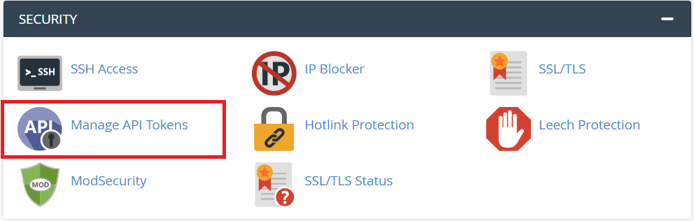

# DNS Updater

DNS Updater provides "present" and "cleanup" functions that [**LEGO**](https://go-acme.github.io/lego) expects from the external program provider.

Please refer to our docs at: [https://dnsupdater.github.io](https://dnsupdater.github.io)

LEGO: Let’s Encrypt client and ACME library written in Go.
Please refer to LEGO docs at [https://go-acme.github.io/lego](https://go-acme.github.io/lego)

### DNS Updater usage:

```
dnsu help

# for cPanel provider
dnsu cpnael --url <cPanel URL> --user <cPanel User> --token <cPanel Token> info <domain name> for A record>
dnsu cpnael --url <cPanel URL> --user <cPanel User> --token <cPanel Token> present <domain name> for TXT record> <auth-key>'
dnsu cpnael --url <cPanel URL> --user <cPanel User> --token <cPanel Token> cleanup <domain name> for TXT record> <auth-key>'

Support Environment Variables:
cPanel URL: DNSU_CPANEL-URL 
cPanel User: DNSU_CPANEL-USER  
cPanel Token: DNSU_CPANEL-TOKEN 
	
```
### Example:
```
# for verify cPanel access
dnsu cpnael --url "https://cpanel-hostname:2083" --user cpaneluser --token "RMYKKBIT5TQ1ITFU58VZBQB5TDEYQZN4" info '_acme-challenge.my.example.org.'
```

### Example update-dns.sh for LEGO:
```
#!/bin/sh
export DNSU_CPANEL-URL="https://cpanel-hostname:2083"
export DNSU_CPANEL-USER=cpaneluser
export DNSU_CPANEL-TOKEN="RMYKKBIT5TQ1ITFU58VZBQB5TDEYQZN4"
dnsu cpanel "$@"
```


### Create cPanel Manage API Token:
# 


### TODO:
- [**LEGO**](https://go-acme.github.io/lego/dns/httpreq/) HTTP request provider.
